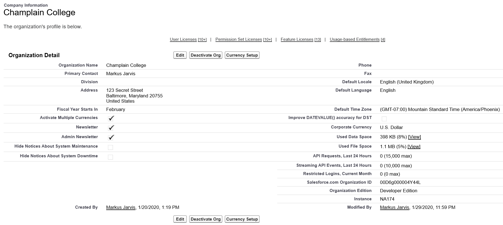
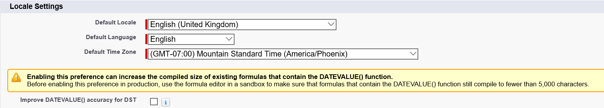
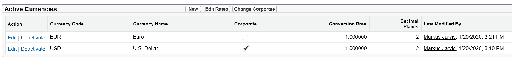
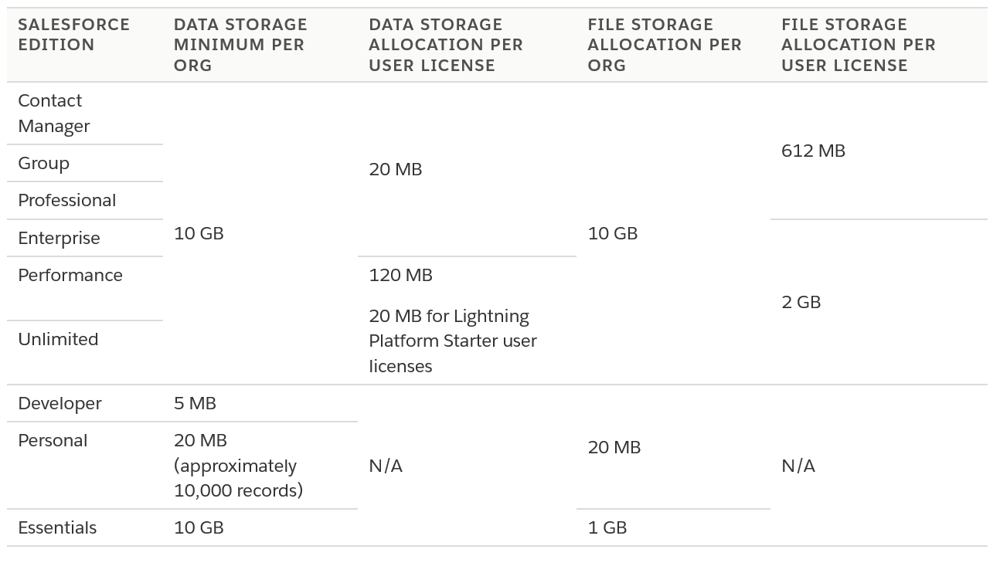

# Organizational Setup

Question weight of this section is 3%.

## Topics Covered

* UI features
* Company information
* Locale settings
* Search results
* List views
* Currency management
* Fiscal year
* Default settings
* Homepage layouts

## Relevant Trailhead Badges

### [Company-Wide Org Settings](https://trailhead.salesforce.com/en/content/learn/modules/company_wide_org_settings)

### [Data Security](https://trailhead.salesforce.com/en/content/learn/modules/data_security)

### [User Authentication](https://trailhead.salesforce.com/en/content/learn/modules/identity_login?trailmix_creator_id=strailhead&trailmix_id=prepare-for-your-salesforce-administrator-credential)

### [Prepare Your Salesforce Org for Users](https://trailhead.salesforce.com/en/content/learn/projects/prepare-your-salesforce-org-for-users)

### [Salesforce Platform Basics](https://trailhead.salesforce.com/en/content/learn/modules/starting_force_com?trailmix_creator_id=strailhead&trailmix_id=prepare-for-your-salesforce-administrator-credential)

## Definitions
* Database - similar to a spreadsheet, but simpler to read.
* Object - tables in a regular (Excel) spreadsheet.
* Records - rows in a spreadsheet.
* Fields - columns in a spreadsheet.
* App - combination of objects/fields/records/etc.
* Org - an instance of Salesforce (for example, your company).
* Multitenancy - sharing resources.
* Metadata - data about data.
* APIs - how software connects to other software.

## Company information

* Company information tells you about your organization; contains org ID.
* Place to access your licenses.
* Place to see data limits and file usage.

            _Company Information Screenshot_

## Locale settings

* Locale changes affect:
  * Language
  * Date/time format
  * Address format
  * Currency format
  * Name format
  * Number format
* Locale settings can be overridden by individual users. This will override the organizational settings for the user.

            _Locale Settings_

[Language, Local, Currency](https://help.salesforce.com/articleView?id=admin_language_locale_currency.htm&type=0)
[Different Formats](https://help.salesforce.com/articleView?id=basics_understanding_values_curr_date_phone.htm&type=5)
[Supported Formats](https://help.salesforce.com/articleView?id=admin_supported_locales.htm&type=5)

## Search results

* Field-level security is enforced in search results (e.g. data not returned if restricted). 
* Wildcard searches are usable with the asterix character. 

## List views

* List Views are lists of records that meet some criteria.
* You can edit, delete, and follow records, along with the number of records to desplay and how you want them sorted/filtered.
* Custom List Views allow for a more customized experience. 

## Currency management

* Currency management accessed via Company Information.
* Currencies should be set to where revenue is reported.
* Currencies can be single or multi-currency; single currency is the default.
* Currency shown in the org will reflect the currency locale that is picked.

            _Currency Setup_

* Individual users can set their own currency, which is then used for that individual.
* Managing currencies provides exchange rate management including dated exchange rates.
* __Multiple currencies cannot be disabled once enabled.__

[Multiple Currencies](https://help.salesforce.com/articleView?id=admin_currency.htm&type=0)
[Multiple Currencies Considerations](https://help.salesforce.com/articleView?id=admin_enable_multicurrency_implications.htm&type=5)

## Fiscal year

* Follows the Gregorian Calendar; does not start in January.
* Fiscal years are defined one at a time.
* Used in reporting, opportunities, and forecasting.
  * Fiscal year can be based on ending or starting month or be configured as a custom fiscal year.

### Custom Fiscal years

* Allows for custom periods (e.g. 13-week quarters, 3-quarter years).
* Can be modified at any time.
* Cannot revert once enabled, but you can use the custom fiscal years to create standard fiscal years.

[Define Your Fiscal Year](https://help.salesforce.com/articleView?id=admin_about_cfy.htm&type=5)

## Homepage layouts

* Homepages can be customized through use of the app builder. 

## Additional Notes & Facts

* 18 supported languages at this time (all Salesforce features will display in that language).
* 17 end user languages (all standard object field labels and pages works).
* Over 30 platform only languages.

[Supported Languages](https://help.salesforce.com/articleView?id=faq_getstart_what_languages_does.htm&type=5)

# Section Review

This is a small section of the exam totaling between 1-3 questions. If you are setting up a brand new org you will probably spend a good chunk of time here - understandably so. Similar to an About page, you will find company information and settings here (e.g. languages, hours/holiday information, time zones, locales, fiscal year information, Salesforce licenses, etc.).

Your locale is going to contain information and settings that pertain to where you live. The language you speak may depend on where you are located; as does your time zone, currency, and phone numbers (area code). This will be set for the organization, but remember that users can override some of these setting with their personal preferences. Also important to remember is the fact that, depending on your locale, the way information is displayed will change (the number 1000 in the U.S. = 1,000 while in Germany = 1.000).

Not all languages are support, though most major ones are. This is also customizable on the individual level. If a company is located in the U.S. but has a branch in Mexico, it makes sense for those employees to be able to switch their language to Spanish. Time Zones are similarly overridden by the user.

Currencies can be set in a variety of ways, but once multi-currency is enabled, it is permanent. You can set daily conversion rates (and even save them), but they appear to need to be changed manually.

Licenses provide the extra goodies that can make an org more productive - but this does come at a significant price. Remember that you pay not based on how many licenses are actually being used, but based on how many licenses you own (used/unused).

Fiscal Years can get confusing, but remember that they are customizable and you can set your physical year however you want. The standard fiscal year follows the Gregorian calendar (12 months). Custom fiscal years allow for customization. Remember that just like multi-currencies, it cannot be disabled once enabled. However, you can always create a standard (12-month) year using the custom approach.

This section also covers the two types of storage: data and file. Records use data storage and files use file storage (attachments, document, etc.). For example, you can how much storage space you have left. For example:

