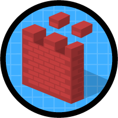

# Organizational Setup

Question weight of this section is 3%.

## Topics Covered

* UI features
* Company information
* Locale settings
* Search results
* List views
* Currency management
* Fiscal year
* Default settings
* Homepage layouts

## Relevant Trailhead Badges

### [Company-Wide Org Settings](https://trailhead.salesforce.com/en/content/learn/modules/company_wide_org_settings)

### [Data Security](https://trailhead.salesforce.com/en/content/learn/modules/data_security)

### [User Authentication](https://trailhead.salesforce.com/en/content/learn/modules/identity_login?trailmix_creator_id=strailhead&trailmix_id=prepare-for-your-salesforce-administrator-credential)

### [Prepare Your Salesforce Org for Users](https://trailhead.salesforce.com/en/content/learn/projects/prepare-your-salesforce-org-for-users)

### [Salesforce Platform Basics](https://trailhead.salesforce.com/en/content/learn/modules/starting_force_com?trailmix_creator_id=strailhead&trailmix_id=prepare-for-your-salesforce-administrator-credential)

## Definitions
* Database - similar to a spreadsheet, but simpler to read.
* Object - tables in a regular (Excel) spreadsheet.
* Records - rows in a spreadsheet.
* Fields - columns in a spreadsheet.
* App - combination of objects/fields/records/etc.
* Org - an instance of Salesforce (for example, your company).
* Multitenancy - sharing resources.
* Metadata - data about data.
* APIs - how software connects to other software.

## UI features

TODO______________

## Company information

* Company information tells you about your organization; contains org ID.
* Place to access your licenses.
* Place to see data limits and file usage.

            _Company Information Screenshot_

## Locale settings

* Locale changes affect:
  * Language
  * Date/time format
  * Address format
  * Currency format
  * Name format
  * Number format
* Locale settings can be overridden by individual users. This will override the organizational settings for the user.

            _Locale Settings_

[Language, Local, Currency](https://help.salesforce.com/articleView?id=admin_language_locale_currency.htm&type=0)
[Different Formats](https://help.salesforce.com/articleView?id=basics_understanding_values_curr_date_phone.htm&type=5)
[Supported Formats](https://help.salesforce.com/articleView?id=admin_supported_locales.htm&type=5)

## Search results
## List views
## Currency management

* Currency management accessed via Company Information.
* Currencies should be set to where revenue is reported.
* Currencies can be single or multi-currency; single currency is the default.
* Currency shown in the org will reflect the currency locale that is picked.

            _Currency Setup_

* Individual users can set their own currency, which is then used for that individual.
* Managing currencies provides exchange rate management including dated exchange rates.
* __Multiple currencies cannot be disabled once enabled.__

[Multiple Currencies](https://help.salesforce.com/articleView?id=admin_currency.htm&type=0)
[Multiple Currencies Considerations](https://help.salesforce.com/articleView?id=admin_enable_multicurrency_implications.htm&type=5)

## Fiscal year

* Follows the Gregorian Calendar; does not start in January.
* Fiscal years are defined one at a time.
* Used in reporting, opportunities, and forecasting.
  * Fiscal year can be based on ending or starting month or be configured as a custom fiscal year.

### Custom Fiscal years

* Allows for custom periods (e.g. 13-week quarters, 3-quarter years).
* Can be modified at any time.
* Cannot revert once enabled, but you can use the custom fiscal years to create standard fiscal years.

[Define Your Fiscal Year](https://help.salesforce.com/articleView?id=admin_about_cfy.htm&type=5)

## Default settings

## Homepage layouts

## Additional Notes & Facts

* 18 supported languages at this time (all Salesforce features will display in that language).
* 17 end user languages (all standard object field labels and pages works).
* Over 30 platform only languages.

[Supported Languages](https://help.salesforce.com/articleView?id=faq_getstart_what_languages_does.htm&type=5)
