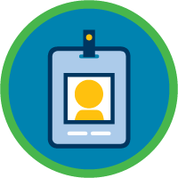
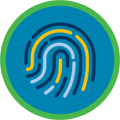
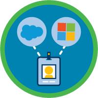

# Security and Access

Question weight of this section is 13%.

## Topics Covered

* Passwords and Policies  
* Password Restrictions and Resetting
* User Authentication
* IP Restrictions
* Org-Level Trusted IP Ranges
* Login Hours
* Identify Confirmation
* Login Forensics
* Security Health Check
* My Domain

## Relevant Trailhead Badges

### [Identity Basics](https://trailhead.salesforce.com/en/content/learn/modules/identity_basics?trail_id=identity)

### [User Authentication](https://trailhead.salesforce.com/en/content/learn/modules/identity_login?trail_id=identity)

### [Identity for Customers](https://trailhead.salesforce.com/en/content/learn/modules/identity_external?trail_id=identity)

### [Identity for Mobile-Cnetric Customers](https://trailhead.salesforce.com/en/content/learn/modules/identity-for-mobile-centric-customers?trail_id=identity)

### [Identity Connect Basics](https://trailhead.salesforce.com/en/content/learn/modules/identity_connect?trail_id=identity)

## General Notes

Access to data can be configured at 4 different levels: Organization, Objects, Fields, Records. You can restrict access at these levels by:

* Organization - maintaining lists of authorized users, creating password policies, and/or restricting logins from certain locations (IP) or hours.
* Objects - control what data users can access (for example, you can restrict the Complaint object to just be viewable by the Human Resources department).
* Fields - control what users can see what individual fields (which are located on objects).
* Records - this controls individual records and who can access them. This could be applied to allow a doctor to view only records that are for his patients and not other patients throughout the practice. Record level access can be controlled through the following:
  * Organizational-wide defaults - set access throughout the org. For example, you could allow everyone in your organization to see contact information for clients, but restrict access to their personal phones to only your salespeople.
  * Role hierarchies - think of inheriting subordinate records. CEO and admins are up top with access to almost everything, followed by managers, followed by salespeople.
  * Sharing Rules - exceptions for groups of users. Put people into a group and then allow that group access to whatever they may have been restricted from.
  * Manual Sharing - allows users to share records between each other (manually).

## Passwords and Policies

Each user is provided with unique username and password. These must be entered during login and should be updated on a regular basis. Ways of protecting password services include:

* Password Policies - cannot contain username, first name, last name.
* Password Expiration
* Password Reset
* Login Attempts and Lockout Periods

## Password Restrictions and Resetting

## User Authentication
## IP Restrictions
## Org-Level Trusted IP Ranges
## Login Hours
## Identify Confirmation
## Login Forensics
## Security Health Check
## My Domain

* Company information tells you about your organization; contains org ID.
* Place to access your licenses.
* Place to see data limits and file usage.

            _Company Information Screenshot_
