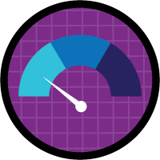

# Sales and Marketing Applications

Question weight of this section is 14%.

## Topics Covered

## Relevant Trailhead Badges

### [Create Reports and Dashboards for Sales and Marketing Managers](https://trailhead.salesforce.com/en/content/learn/projects/create-reports-and-dashboards-for-sales-and-marketing-managers)

### [Intelligent Marketing, Sales, and Customer Service for Banks](https://trailhead.salesforce.com/en/content/learn/modules/intelligent-marketing-and-customer-service-for-banks)

### [Marketing Cloud Basics](https://trailhead.salesforce.com/en/content/learn/modules/mrkt_cloud_basics)

### [Einstein Account-based Management](https://trailhead.salesforce.com/en/content/learn/modules/einstein-account-based-marketing)

### [Marketing Cloud Connect](https://trailhead.salesforce.com/en/content/learn/modules/marketing-cloud-connect)

## Definitions

*

## Opportunity Management and Sale Stages
## The Sales process
## Forecasting
## Collaborative Forecasting
## Sharing Forecasting
## Territory Forecasts
## Quotes
## Quote Syncing
## Opportunity Splits and Custom Splits
## Orders
## Reduction Orders
## Paths
## Kanban
## Sales Console
## Macros
## Opportunity Workspace
## Products and Product Schedules
## Price Book
## Price Book Visibility
## Big Deals
## Update Reminders
## Similar Opportunities
## Team Selling
## Opportunity Teams
## Account Teams
## Contact roles
## Opportunity with Insights
