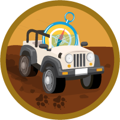

# Service and Support Applications

Question weight of this section is 13%.

## Topics Covered

## Relevant Trailhead Badges

### [Priority Support Services](https://trailhead.salesforce.com/en/content/learn/modules/priority-support-services)

### [Create Process for Managing Support Services](https://trailhead.salesforce.com/en/content/learn/projects/create-a-process-for-managing-support-cases)

### [Service Cloud Efficiancy](https://trailhead.salesforce.com/en/content/learn/modules/service-cloud-platform-efficiency)

### [Service Cloud Rollout Strategy](https://trailhead.salesforce.com/en/content/learn/modules/service-cloud-rollout-strategy)

### [Service Cloud Essential Features](https://trailhead.salesforce.com/en/content/learn/modules/service-cloud-essentials-features)

## Case Record Page
Case Feed
Case Emails
Service Console
Salesforce Knowledge
Solutions
Related Cases
Case Comments
Case Settings
Case Assignment Rules
Case Auto-Response Rules
Case Escalation Rules
Web to Case
Email to Case
Case Teams
Reassigning Ownership
Case Views and Queues
Case Macros and Queues
Surveys
Knowledge Setup, Settings, Permissions
Understanding Data Categories/Groups
Data Categories, Mapping
Classical Knowledge Article Types
Lightning Knowledge
Migration Tool
Lookup Fields for Article Versions
Communities
Customer/Partner Communities
Employee Communities
Community Sharing and Security Features
External User Accounts
Sharing Data with Externals
Community Template
Ideas
Chatter Questions
