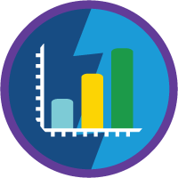
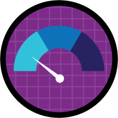

# Analytics - Reports and Dashboards

Question weight of this section is 10%.

## Topics Covered

* Creating/Customizing Reports (options)
* Sharing Models on Reports
* Creating/Modifying Dashboards
* Custom Report Types
* Salesforce Classic Features
* Classic Reports
* Lightning Reports
* Sharing Model
* Considerations for displaying Dashboard
* Dashboard Components
* Data Sources and Dashboard Components
* Charts
* Scheduling
* Considerations
* Custom Report Types
* Standard vs Custom Report Types
* Consdierations to Custom Report Types

## Relevant Trailhead Badges

### [Explore with Analytics](https://trailhead.salesforce.com/en/content/learn/trails/wave_analytics_explorer)

### [Build and Administer Einstein Analytics](https://trailhead.salesforce.com/en/content/learn/modules/wave_analytics_basics)

### [Einstein Analytic Basics](https://trailhead.salesforce.com/en/content/learn/modules/wave_analytics_basics)

### [Reports and Dashboards](https://trailhead.salesforce.com/en/content/learn/modules/lex_implementation_reports_dashboards)

### [Create Reports and Dashboards](https://trailhead.salesforce.com/en/content/learn/projects/create-reports-and-dashboards-for-sales-and-marketing-managers)

## * Creating/Customizing Reports (options)
* Sharing Models on Reports
* Creating/Modifying Dashboards
* Custom Report Types
* Salesforce Classic Features
* Classic Reports
* Lightning Reports
* Sharing Model
* Considerations for displaying Dashboard
* Dashboard Components
* Data Sources and Dashboard Components
* Charts
* Scheduling
* Considerations
* Custom Report Types
* Standard vs Custom Report Types
* Consdierations to Custom Report Types
