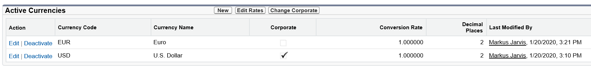

# Organizational Setup

Question weight of this section is 3%.

## Topics Covered

* UI features
* Company information
* Locale settings
* Search results
* List views
* Currency management
* Fiscal year
* Default settings
* Homepage layouts

## Relevant Trailhead Badges

### Company-Wide Org Settings

### Data Security

### User Authentication

### Prepare Your Salesforce Org for Users

### Salesforce Platform Basics

## UI features
## Company information

            _Company Information Screenshot_

## Locale settings

## Search results
## List views
## Currency management

* Currency management accessed via Company Information.
* Currencies should be set to where revenue is reported.
* Currencies can be single or multi-currency; single currency is the default.
* Currency shown in the org will reflect the currency locale that is picked.

            _Currency Setup_

* Individual users can set their own currency, which is then used for that individual.
* Managing currencies provides exchange rate management including dated exchange rates.
* __Multiple currencies cannot be disabled once enabled.__

## Fiscal year
## Default settings
## Homepage layouts
