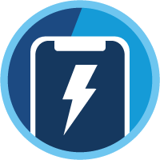
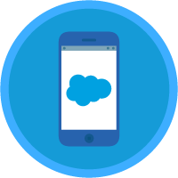
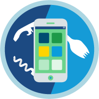
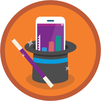
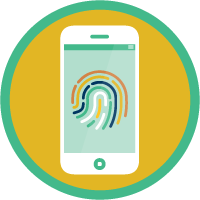

# DESKTOP AND MOBILE ADMINISTRATION

The weight of this section is 3%.

## Topics Covered

* Introduction
* Overview

## Relevant Trailhead Badges

TODO______________
### [Lightningn Experience for Salesforce Mobile](https://trailhead.salesforce.com/en/content/learn/modules/lightning-experience-for-salesforce-mobile-app)

### [Salesforce Mobile App Customization](https://trailhead.salesforce.com/en/content/learn/modules/salesforce1_mobile_app)

### [Salesforce Mobile App Basics](https://trailhead.salesforce.com/en/content/learn/modules/lex_salesforce1_basics)

### [Salesforce Mobile App Rollout](https://trailhead.salesforce.com/en/content/learn/modules/salesforce1_rollout)

### [Salesforce Mobile App Security and Compliance](https://trailhead.salesforce.com/en/content/learn/modules/salesforce1_security)

## Definitions

## Introduction

  This section is primarily concerned with the Salesforce mobile application which is available for both Android and iOS. With the Salesforce application, users have access to their data as well as many of the features found on the web version of Salesforce.

## 
