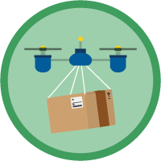

# AppExchange

The weight of this section is 3%.

## Topics Covered

* Introduction
* Overview

## Relevant Trailhead Badges

TODO______________
### [AppExchange Basics](https://trailhead.salesforce.com/en/content/learn/modules/appexchange_basics)

### [AppExchange Solutions](https://trailhead.salesforce.com/en/content/learn/modules/appexchange-solutions)

### [Meet Your Business Needs with AppExchange](https://trailhead.salesforce.com/en/content/learn/trails/meet-your-business-needs-with-appexchange)

### [AppExchange App Development](https://trailhead.salesforce.com/en/content/learn/modules/isv_app_development)

### [AppExchange Partner Basics](https://trailhead.salesforce.com/en/content/learn/modules/isvforce_basics)

### [AppExchange Checkout](https://trailhead.salesforce.com/en/content/learn/modules/appexchange-checkout)

### [Appexchange App Updates](https://trailhead.salesforce.com/en/content/learn/modules/appexchange_app_updates)

## Definitions

## Introduction

  This section is primarily concerned with the Salesforce mobile application which is available for both Android and iOS. With the Salesforce application, users have access to their data as well as many of the features found on the web version of Salesforce.

## 
