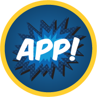
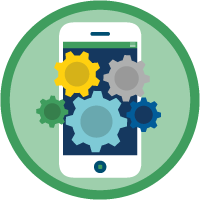
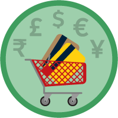

# AppExchange

The weight of this section is 3%.

## Topics Covered

* Overview

## Relevant Trailhead Badges

TODO______________
### [AppExchange Basics](https://trailhead.salesforce.com/en/content/learn/modules/appexchange_basics)

### [AppExchange Solutions](https://trailhead.salesforce.com/en/content/learn/modules/appexchange-solutions)

### [Meet Your Business Needs with AppExchange](https://trailhead.salesforce.com/en/content/learn/trails/meet-your-business-needs-with-appexchange)

### [AppExchange App Development](https://trailhead.salesforce.com/en/content/learn/modules/isv_app_development)

### [AppExchange Partner Basics](https://trailhead.salesforce.com/en/content/learn/modules/isvforce_basics)

### [AppExchange Checkout](https://trailhead.salesforce.com/en/content/learn/modules/appexchange-checkout)

### [Appexchange App Updates](https://trailhead.salesforce.com/en/content/learn/modules/appexchange_app_updates)

## Overview

  Think of the AppExchange as your basic app store. The AppExchange offers you Salesforce/third-party application to make use of with your org. These will be much more spicific and will ususally be tailored to a specific business need. Applications found here include both both free and paid apps. The exchange is run by Salesforce.

* Packages are installed and consist of the componenets of an application. These components are requirements needed for the application, such as tabs, objects, code, etc.
* Use Cases for AppExchange applications include: DocuSign integration, Prebuilt Dashboards/Reports, Productivity applications, Surveys, Social Tools, Education applications, Project Management, Finance applications, Timesheets, etc.

